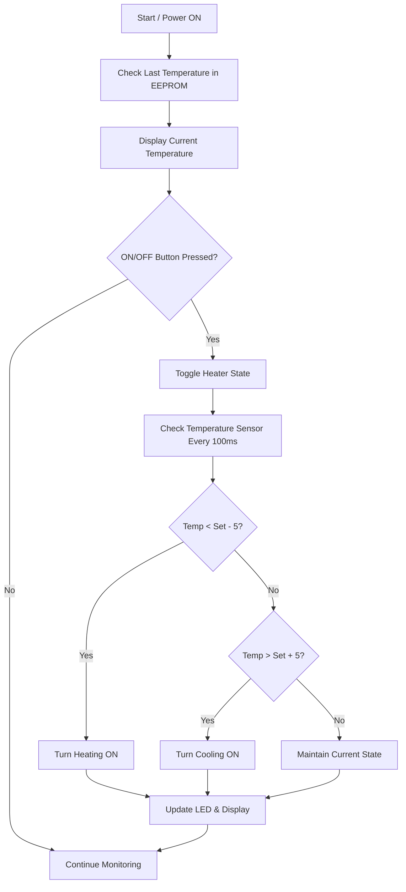

# 🔥 Electric Water Heater – Embedded Systems Diploma Project  

)

---

## 🌊 **Project Overview**  

**🔥 Smart Electric Water Heater 🔥**  
*🚀 A complete embedded system controlling water temperature, heating & cooling, with interactive user interface using seven-segment displays.*  

This project was developed as an **Embedded Systems Diploma Graduation Project (Jan 2023 – Feb 2023)**, aiming to simulate a **fully functional electric water heater system** using AVR microcontroller code and **Proteus simulation**.  

---

## 📈 **Key Features** 💡  

### 🎯 Temperature Control
- Adjust water temperature via **Up/Down buttons**  
- Initial temperature: **60°C** | Range: **35°C – 75°C**  
- Last set temperature saved in **EEPROM** and restored after power-off  

### 🔌 ON/OFF Behavior
- System **OFF by default** on startup  
- **ON/OFF button** toggles heater state  
- Displays turn off when system is OFF  

### 🌡️ Temperature Sensing
- Sensor reads water temperature every **100 ms**  
- System averages last **10 readings** to decide heating/cooling  

### 🔥 Heating & Cooling Elements
- Heating element **activates** 5°C below set temperature  
- Cooling element **activates** 5°C above set temperature  
- Real-time control based on measured temperature  

### 🖥️ Seven-Segment Display Interface
- Shows **current or set temperature**  
- Blinks in temperature-setting mode  
- Exits setting mode if no buttons pressed for **5 seconds**  

### 💡 Heating Element LED
- LED **blinks** when heating element is ON  
- LED stays **solid** when cooling element is ON  

---

## 🚀 **Technical Highlights**  

### ⚡ Efficient Embedded Design
- Modular C code for **ADC, UART, I2C, EEPROM, LCD, TIMER**  
- Real-time temperature monitoring & control  

### 🛡️ Reliability & Safety
- Persistent temperature storage via EEPROM  
- Timed sensor readings & display updates  
- Safe control logic for heating/cooling elements  

### 🌍 Simulation & Testing
- Fully simulated in **Proteus**  
- Compatible with **AVR microcontrollers** (ATmega series)  

---

## 🎨 **Workflow Diagram**

## 🌐 User Interface

Seven-segment displays show current or set temperature

Buttons for Up, Down, and ON/OFF control

LED indicator shows heating/cooling element status

## 💡 Future Enhancements

Add LCD interface for richer and more interactive UI

Integrate Wi-Fi / IoT to remotely monitor and control water temperature

Implement energy-saving algorithms for smart heating

